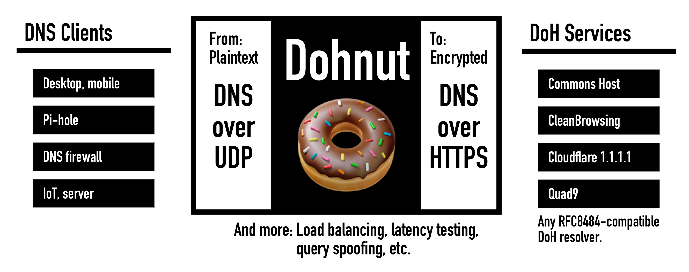

# Dohnut

Dohnut is a DNS to DNS-over-HTTPS (DoH) proxy server. Dohnut improves the performance, security, and privacy of your DNS traffic.

https://help.commons.host/dohnut/

Dohnut works with any open standard ([RFC8484](https://tools.ietf.org/html/rfc8484)) compliant DoH provider, including the [Commons Host](https://commons.host) DoH service.



## Features

**High Performance** Auto-select the fastest DoH resolver. Continuously adapts to network and service conditions by monitoring the round-trip-tip of the DoH connection using HTTP/2 PING frames.

**High Availability** Allows using multiple DoH resolvers at once to provide automatic failover in case a service is unavailable.

**Zero Overhead** - Network traffic does not go through Dohnut so there is no performance penalty. Only the DNS queries (very little bandwidth) are proxied.

**Lightweight** - Multi-threaded architecture for fast performance on low-power devices like single board computers. Designed for Raspberry Pi and Odroid but compatible with anything that can run Node.js.

**Full Encryption** - DoH encrypts all DNS queries inside a secure HTTP/2 connection. This protects DNS lookups against snooping at your local network router or ISP.

**Connection Sharding** - Spread queries across multiple DoH resolvers for improved privacy. This reduces the amount of information a single DoH service can collect.

**Query Spoofing** - Mask your DNS queries using fake DNS queries. Uses several randomisation techniques and samples from a public list of the top 1 million domains.

**User Agent Spoofing** - Avoid tracking at the HTTP level using fake browser identifiers. Randomly chosen from a public list of real-world browser data.

## Usage

Dohnut is lightweight and cross-platform. Dohnut can operate standalone or with other DNS tools like [Pi-hole](https://pi-hole.net).

Dohnut can be used in several ways:

- [Command line interface](./cli)
- [Docker: container image](./docker)
- [Linux: managed by systemd](./systemd)
- [macOS: managed by launchd](./macos)
- [Pi-hole: upstream DNS server](./pihole)

This example launches Dohnut on your local machine to accept DNS connections and proxy them to the Commons Host DNS over HTTPS (DoH) service. See the [command line interface](./cli) reference for more options.

```shell
$ sudo npx dohnut --listen 127.0.0.1:53 --doh https://commons.host

Started listening on 127.0.0.1:53 (udp4)
```

Verify by running a DNS lookup against Dohnut. The query is proxied to the DoH service.

```shell
$ dig @localhost iana.org

; <<>> DiG 9.10.6 <<>> @localhost iana.org
; (2 servers found)
;; global options: +cmd
;; Got answer:
;; ->>HEADER<<- opcode: QUERY, status: NOERROR, id: 24758
;; flags: qr rd ra ad; QUERY: 1, ANSWER: 1, AUTHORITY: 0, ADDITIONAL: 1

;; OPT PSEUDOSECTION:
; EDNS: version: 0, flags:; udp: 4096
;; QUESTION SECTION:
;iana.org.			IN	A

;; ANSWER SECTION:
iana.org.		3591	IN	A	192.0.43.8

;; Query time: 4 msec
;; SERVER: 127.0.0.1#53(127.0.0.1)
;; MSG SIZE  rcvd: 53
```

## Credits

Made by [Kenny Shen](https://www.machinesung.com) and [Sebastiaan Deckers](https://twitter.com/sebdeckers) for 🐑 [Commons Host](https://commons.host).
